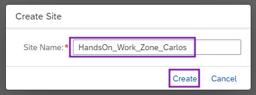

# Exercício 01 - Criação do site com SAP Build Work Zone

Bem Vindo! Ao acessar o Lobby do SAP Build Work Zone você tem acesso para criar seus sites customizáveis.

> #### Escopo inicial da nossa aplicação.
> - Adicionar um app SAPUI5 no site
> - Fazer deploy de uma aplicação Fiori do BAS, e adicionar no site
> - Customizar tema do site Work Zone
> - Visualização do site no mobile, utilizando o SAP Mobile Start 

### Primeiro passo: Criação do site
1. Dentro do **diretório de sites (Site Directory)** do Work Zone, vamos iniciar nosso processo de desenvolvimento clicando no botão **Create Site**.
   
  

2. Nessa modal, colocaremos o nome do nosso site como **"HandsOn_Work_Zone_[Nome]"**, e vamos clicar em **Create**. 
   
  

3. Ao criar o site, você será redirecionado para as **configurações do site (Site Settings)**, onde você pode editar as configurações e atribuir permissões para o site. Navegue de volta para o **diretório de sites** para ver a criação de seu site.
   
  
  

## Próximo Passo:
[Exercício 02 - Adicionar um App SAPUI5 no seu site](/exercises/ex2/README.md)