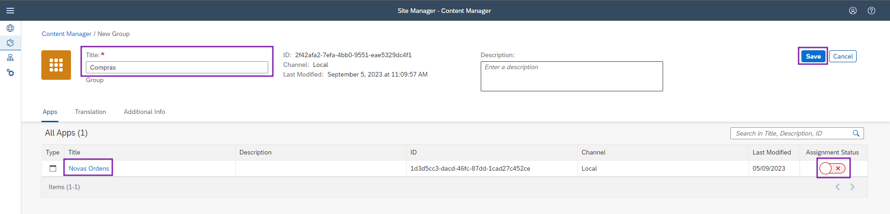

# Exercício 02 - Adicionar um App SAPUI5 no seu site

### Primeiro passo: Abrir o Gerenciamento de Conteúdo (Content Manager)
1. Dentro do **diretório de sites (Site Directory)**, navegue para o **gerenciamento de conteúdo dos sites (Content Manager)**.
  

### Segundo passo: Crie e configure um novo app
1. Clique em **"Create"**, e selecione **"App"**.
  

2. Preencha os seguintes campos com os valores:
  * **Title**: `Novas Ordens`
  * **Open App**: In place
  * **URL**: `https://sapui5.hana.ondemand.com/test-resources/sap/m/demokit/cart/webapp/index.html`
  

3. Vá para a aba **"Navigation"**.
  

4. Preencha os seguintes campos com os valores:
  * **Semantic Object**: `Order`
  * **Action**: `display`
  

5. Vá para a aba **"Visualization"**.
  

6. Preencha os seguintes campos com os valores:
  * **Subtitle**: `Carrinho de compras`
  * **Information**: `Compre  agora!`
  * **Icon**: `Compre  agora!`
  
    > Na direita, você pode ver a pré-visualização de como ficará sua aplicação no WorkZone. Após isso, clique no botão **"Save"**.

### Terceiro passo: Atribuír a permissão todos (Everyone) ao seu app
> Para que seu app fique visível para todos os usuários, é necessário atribuír a permissão "Everyone" à ele, o que será ensinado nesse passo.

1. Clique eu **"Content Manager"** para retornar à listagem de conteúdos.
  

2. Selecione a linha **"Everyone"**, na listagem.
  

3. Na tela, clique no botão **"Edit"**, à direita.
  

4. Ao entrar na edição, procure a linha correspondente ao seu app **"Novas Ordens"**. Clique no botão **"Assignment Status"** na respectiva linha, e após clique em **"Save"**.
  

5. Agora você pode visualizar seu app na listagem. Clique em **"Content Manager"** para retornar.
  

### Quarto passo: Criar um grupo e atribuir o app à ele
> Um grupo é um conjunto de um ou mais apps que são apresentados juntos no site. Ao atribuir apps aos grupos, deixamos eles visíveis ao usuário.

1. Clique em **"Create"**, e selecione **"Group"**.
  

2. Preencha o campo **"Title"** com o valor **"Compras"**. 
  Procure a linha correspondente ao seu app **"Novas Ordens"**. Clique no botão **"Assignment Status"** na respectiva linha, e após clique em **"Save"**.
  

## Revisão
Pronto! Agora você já pode visualizar o app que adicionamos no seu site, no grupo "Compras" 

## Próximo Passo:
[Exercício 03 - Adicionar um App Fiori do BAS](/exercises/ex3/README.md)