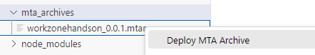
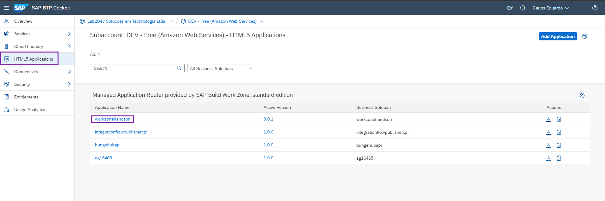

# Exercício 03 - Adicionar um App Fiori do BAS

### Primeiro passo: Setup BAS

1. Abra a página [SAP BTP Trial Start](https://account.hanatrial.ondemand.com/trial/#/home/trial).

2. Clique em **"SAP Business Application Studio"**.
   
  

3. Clique em **"Create Dev Space"**.
   
  

4. Coloque o nome do Dev Space de **"WorkZone"**, e clique em **Create Dev Space**.
   
  
  > Espere até que o status fique como **"RUNNING"**.

5. Clique no nome do Dev Space **"WorkZone"**.
   
  

## Segundo passo: Criar projeto SAPUI5

1. Clique em **"New Project from Template"**.
   
  

2. Clique em **"New Project from Template"**.
   
  

3. Selecione **"SAP Fiori application"**, depois clique no botão **Start**.
   
  

4. Selecione **"Basic"**, e clique em **Next**.
   
  

5. Em **"Data Source"**, selecione **"None"**, e clique em **Next**.
   
  

6. Em **"Entity Selection"**, clique em **Next**.
   
  

7. No **"Project Attributes"**, preencha com os seguintes valores:
    | Step | Parameter | Value |
    |:-----|:----------|:------|
    | A | Module name | **`hands-on`** |
    | B | Application title | **Hands On** |
    | C | Application namespace | **workzone** |
    | D | Description | **A Fiori application.** |
    | E | Project folder path | **`/home/user/projects`** (default)|
    | F | Minimum SAPUI5 version | **1.118.0** (default) |
    | G | Add deployment configuration | **Yes** (default)|
    | H | Add FLP configuration | **Yes** |
    | I | Configure advanced options | **No** (default) |

    

    E clique em **Next**.

8. Em **"Deployment Configuration"**, selecione o *target* como **"Cloud Foundry"**, *Destination name* como **"None"**, e *"Add application to managed application router"* selecione **"Yes"**. Após, clique no botão **Next**.
   
  

9. Em **"Fiori Launchpad Configuration"**, preencha os seguintes valores:
    | Step | Parameter | Value |
    |:-----|:----------|:------|
    | A | Module name | **`handson`** |
    | B | Application title | **Hands On** |
    | C | Application namespace | **workzone** |
    | D | Description | **A Fiori application.** |
    | E | Project folder path | **`/home/user/projects`** (default)|
    | F | Minimum SAPUI5 version | **1.118.0** (default) |
    | G | Add deployment configuration | **Yes** (default)|
    | H | Add FLP configuration | **Yes** |
    | I | Configure advanced options | **No** (default) |

    

    E clique em **Finish**.

> Espere a finalização da criação do projeto para a próxima etapa.

10. Ao finalizar a criação do projeto, selecione **"Open Folder"**, ao aparecer esse modal.
   
  

## Terceiro passo: Deploy da aplicação

1. Para fazer o deploy da aplicação, clique com o botão direito em **"mta.yaml"**, e selecione **"Build MTA Project"**.
   
  

2. Ao finalizar o build, abra a pasta **"mta_archives"**, clique com o botão direito no único arquivo gerado, e selecione **"Deploy MTA Archive"**.
   
  

3. Faça login com seu usuário e senha no Cloud Foundry, e clique em **Sign in**.
   
  

4. Selecione a organização e espaço que deseja fazer deploy no Cloud Foundry, e clique em **Apply**.
   
  

> Com isso, o deploy já irá ser iniciado. Aguarde a finalização.

5. Com o deploy finalizado, você pode encontrar nossa aplicação dentro do **"BTP Cockpit"**, e, **"HTML5 Applications"**.
   
    