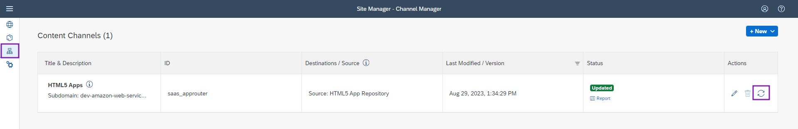
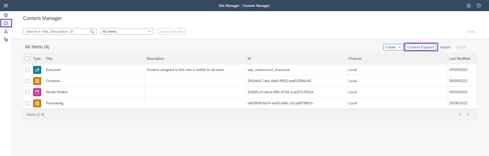
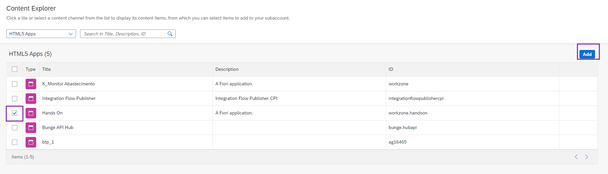
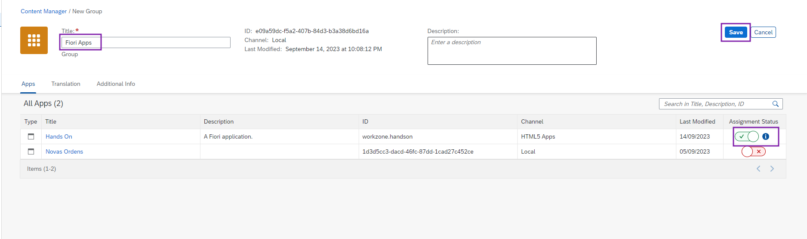
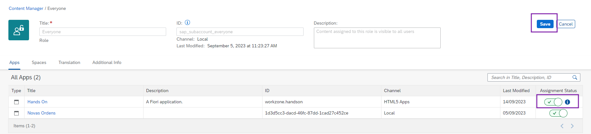
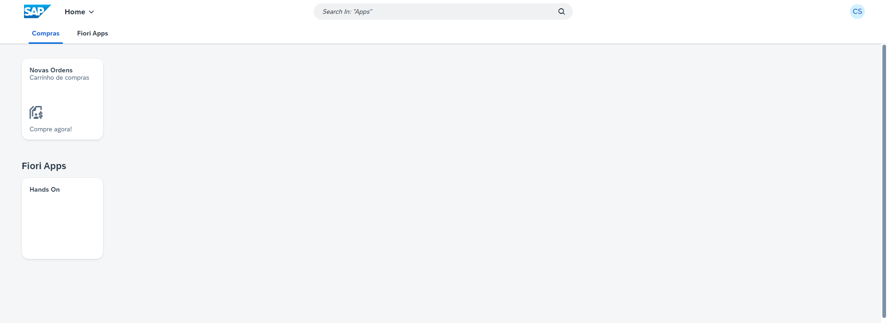

# Exercício 04 - Adicionar um App Fiori no Work Zone

### Primeiro passo: Atualizar conteúdo
1. Dentro do Work Zone, clique no ícone sinalizado à esquerda, e selecione o botão de reload em **"HTML5 Apps"**.
  

### Segundo passo: Adicionar aplicação SAPUI5 para o "Content"
1. Vá para a aba de **"Content Manager"**, e clique no botão **"Content Explorer"**.
    

2. Clique em **"HTML5 Apps"**.
  

3. Selecione nosso app e clique em **"Add"**.
  

4. Vamos criar um novo grupo chamado **"Fiori Apps"**.
  

5. Adicionar nosso novo grupo na role **"Everyone"**.
  

> Pronto, podemos verificar o nosso novo grupo como **"Fiori Apps"** no site.
  